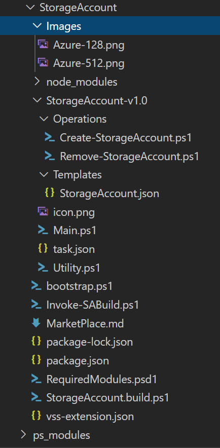
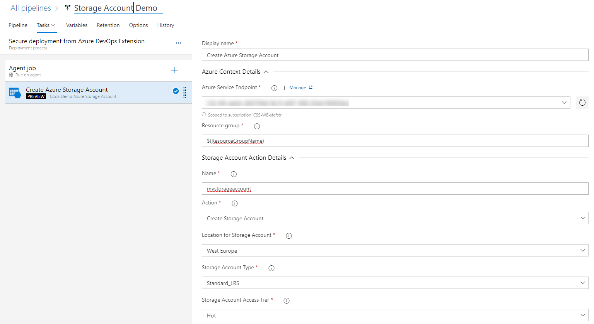

---
layout: post
title: Comparing Azure DevOps Extensions with Github Actions
categories: [CI/CD]
tags: [CI/CD]
comments: true
---

In my [last blog post](https://stefanstranger.github.io/2020/02/28/PlayingWithGitHubActions/) I shared my first experiences with Github Actions. One of the features of Github Actions is that you can publish actions in GitHub Marketplace and share actions you've created with the GitHub community.

After having developed quite some Azure DevOps (Release) Extensions I wanted to learn how to develop custom Github Actions and compare them.

Let's first start with a short intro into Azure DevOps Extensions for those who are unaware of this feature.

# Azure DevOps Extensions

Extensions are simple add-ons that can be used to customize and extend your DevOps experience with Azure DevOps Services. They are written with standard technologies - HTML, JavaScript, CSS - and can be developed using your preferred development tools.

Extensions can have multiple CI/CD Azure Pipelines tasks.

## Advantages of Extension

Some of the advantages of using Azure DevOps Exensions are:

* Easy consumable by DevOps teams
* Available via a (Private) MarketPlace
* Supports versioning of both Extension and Tasks within Extension

Most of the Extensions with Azure Pipeline tasks I've developed where private Extensions to deploy 'certified' Azure Resources/Products which could be consumed by DevOps teams within the customer DevOps organization. Within these Extensions ARM templates and PowerShell scripts are used to deploy the 'certified' Azure Resources/Products.

With 'cerfified' Azure Products customers can embed security and/or service management controls into their to be consumed Azure Products. An example of a security control that could be added to a 'certified' Azure Storage Account product could be that *[all data needs to be encrypted in transit over public and private interconnections](https://docs.microsoft.com/en-us/azure/storage/common/storage-require-secure-transfer)*.

For the *Azure Storage Account*  this would mean that Secure transfer setting of the Storage Accounts needs to be enabled for all Storage Accounts to be deployed by DevOps teams in their pipelines. This setting can be configured in the ARM template used to deploy the Storage Account.

If you want to learn more about how to develop an Azure DevOps Extension you can also view the recording of my PowerShell Conference Europe session called ["Extend your PowerShell skills by creating Azure DevOps Extensions"](https://www.youtube.com/watch?v=2lFgytAJ5hU)

## Azure DevOps Storage Account Extension

The Storage Account Extension with Azure Pipeline tasks is build with PowerShell scripts and an ARM Template.



Within an Azure DevOps Release the following Extension Task parameters can be  configured as input:



In a YAML pipeline it looks as follows:

```yaml
steps:
- task: Demo-StorageAccount@0
  displayName: 'Azure Storage Account on $(ResourceGroupName)'
  inputs:
    azureSubscription: 'Demo Azure Subscription'
    StorageAccountName: mystorageaccount
    AccountType: 'Standard_LRS'
    AccessTier: Hot
```

In the next part of this blog post I want to create the same functionality, to deploy and remove an Azure Storage Account using Github Actions in a Github Workflow.

### Functionality Github Actions:

In the Github Action I want to implement the following functionality.

1. Deploy an Azure Storage Account using an ARM Template with the following parameters:

* Azure Subscription name
* Storage Account name
* Storage Account type (allowed values: "Standard_LRS", "Standard_GRS", "Standard_RAGRS", "Standard_ZRS")
* Storage Account Access Tier (allowed values: "Hot","Cool")

2. Github Action(s) only consumable by authorized Github Environments (simular to Private Visual Studio Marketplace)

## Github Storage Account Action

The Github Storage Account Action is build using a [Docker container](https://help.github.com/en/actions/building-actions/creating-a-docker-container-action). The reason for me using a Docker container to build the Github Action is the reusability of the code I already used for the Azure DevOps Storage Account Extension and actions. 

Currently Github Actions supports the following options to [build Github Actions](https://help.github.com/en/actions/building-actions):
* [Docker container](https://help.github.com/en/actions/building-actions/creating-a-docker-container-action)
* [Javascript](https://help.github.com/en/actions/building-actions/creating-a-javascript-action)

### Steps to create a Docker container Action

1. Create Github Repository
1. Create a Dockerfile
1. Create an action metadata file
1. Write action code
1. Createa README
1. Commit, tag and push action to Github
1. Testing action in workflow


# Comparing Extension with Actions


| Functionality | Extension | Action | Comments  |
|---------------|-----------|--------|-----------|
| Extensibility | Customize and extend DevOps experience with Azure DevOps Services. Not limited to CI/CD tasks. | Automates software workflows. Limited CI/CD tasks. |  |
| Development languages | [Typescript and PowerShell](https://github.com/Microsoft/azure-pipelines-task-lib)* | [Javascript, TypeScript, Python, Java](https://help.github.com/en/actions/language-and-framework-guides) | Focussing on development of CI/CD tasks |
| Marketplace | [Public and private Marketplace](https://marketplace.visualstudio.com/) | [Public Marketplace](https://github.com/marketplace) | For Azure DevOps you can choose to not have your extension publicly published and only shared with certain Azure DevOps Organizations |
| Column 1 | Column 2 |  |  |
| Column 1 | Column 2 |  |  |
| Column 1 | Column 2 |  |  |
| Column 1 | Column 2 |  |  |


# Conclusion


**References:**
* [What are Azure DevOps Extensions?](https://docs.microsoft.com/en-us/azure/devops/extend/overview?view=azure-devops)
* [Reference for integrating custom build tasks into extensions](https://docs.microsoft.com/en-us/azure/devops/extend/develop/integrate-build-task?view=azure-devops&viewFallbackFrom=vsts)
* [Youtube recording PowerShell Conference Europe session by Stefan Stranger - Extend your PowerShell skills by creating Azure DevOps Extensions](https://www.youtube.com/watch?v=2lFgytAJ5hU&t=15s)
* [Visual Studio Market Place](https://marketplace.visualstudio.com/)
* [Create a custom pipelines task](https://docs.microsoft.com/en-us/azure/devops/extend/develop/add-build-task?view=azure-devops)
* [Azure Pipelines Task SDK](https://github.com/Microsoft/azure-pipelines-task-lib)
* [Github Actions](https://github.com/features/actions)
* [Creating a Docker container action](https://help.github.com/en/actions/building-actions/creating-a-docker-container-action)
* [Building (Github Actions](https://help.github.com/en/actions/building-actions)
