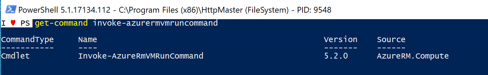

# Solving 'issues' with Azure PowerShell Cmdlets

In this blog post I'm going to share my problem solves steps and thoughts I undertook when I had an issue with one of the Azure PowerShell commands/Cmdlets.

Maybe these steps and thoughts can you help you in similar issues* you are having with interacting with Azure grammatically.

*Issues can be some functionality you are missing using the current Azure PowerShell command, or it can be a real bug with an Azure PowerShell command.

You already know I love to play with REST API's and all the Azure PowerShell commands use the Azure Resource Manager API.

I suggest you first read some of my earlier blog posts explaining the Azure REST API:

* <a href="https://blogs.technet.microsoft.com/stefan_stranger/2016/10/21/using-the-azure-arm-rest-apin-get-access-token/" target="_blank">Using the Azure ARM REST API – Get Access Token</a>
* <a href="https://blogs.technet.microsoft.com/stefan_stranger/2016/10/29/using-the-azure-arm-rest-api/" target="_blank">Using the Azure ARM REST API – Get Subscription Information</a>
* <a href="https://blogs.technet.microsoft.com/stefan_stranger/2016/10/21/using-the-azure-arm-rest-apin-get-access-token/" target="_blank">Using the Azure ARM REST API – End to end Example Part 1</a>
* <a href="https://blogs.technet.microsoft.com/stefan_stranger/2016/11/20/using-the-azure-arm-rest-api-end-to-end-example-part-2/" target="_blank">Using the Azure ARM REST API – End to end Example Part 2</a>

Hope you enjoyed above blog post but now it's time to go back to the 'issue' which let to this blog post.

**Invoke-AzureRMVMRunCommand**

The reason for this blog post was one of the Azure PowerShell cmdlets called Invoke-AzureRMVMRunCommand from the AzureRM.Compute PowerShell module.

**References:**
* <a href="https://github.com/Azure/azure-powershell/issues/5982" target="_blank">Github issue - Invoke-AzureRmVMRunCommand returns empty</a>

