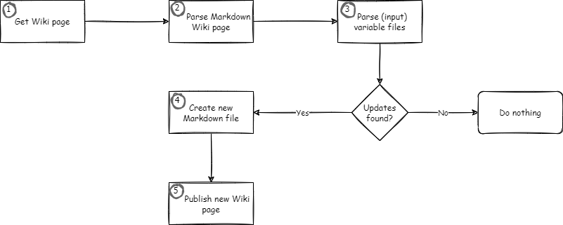

Some time ago a blogged about how you can<a href="https://stefanstranger.github.io/2020/04/25/CreatingAzureDevOpsWIKIPagesFromWithApipelinePart2/" target="_blank"> create Azure DevOps WIKI Pages (Markdown) from within a pipeline</a>.

But recently I again wanted to automatically update an Azure DevOps Markdown Wiki page containing a table and with some PowerShell magic it was not that difficult. In this blog post I'll share how you can do the same and automate the creation of documentation containing Markdown tables.

# High level overview

The complete process looks like this 👇



In this blog post I'm only discussing the steps 2, 3 and 4. For the other steps please have a look at my earlier blog posts on this topic.

Suppose we have the following example Markdown content:

## Header

Lorem ipsum dolor sit amet, consectetur adipiscing elit, sed do eiusmod tempor incididunt ut labore et dolore magna aliqua. Ut enim ad minim veniam, quis nostrud exercitation ullamco laboris nisi ut aliquip ex ea commodo consequat. Duis aute irure dolor in reprehenderit in voluptate velit esse cillum dolore eu fugiat nulla pariatur. Excepteur sint occaecat cupidatat non proident, sunt in culpa qui officia deserunt mollit anim id est laborum.

### Tables

#### Table 1

This is the first table in this Markdown file.

|First Name|Last Name|Date Generated|
|----------|---------|--------------|
|Stefan|Stranger|01/01/2022|
|John|Doe|02/01/2022|

#### Table 2

This is the second table in this Markdown file.

|Brand|Type|Date Generated|
|-----|----|--------------|
|Tesla|Model 3|01/01/2022|
|Toyota|Auris|02/01/2022|

And we have the following two json input files which we want to use to validate if the tables in above Markdown document need to be updated.

table1.json

```json
{
    "People": [
        {
            "First Name": "Jane",
            "Last Name": "Doe"
        },
        {
            "First Name": "Foo",
            "Last Name": "Bar"
        }
    ]
}
```

table2.json

```json
{
  "Cars": [
    {
      "Brand": "Porsche",
      "Type": "911"
    }
  ]
}
```

The [PSDocs PowerShell module](https://github.com/microsoft/PSDocs) uses [Template Markdown document file](https://github.com/microsoft/PSDocs) like this one I created below for the blog post.

MarkdownTables.Doc.ps1
```PowerShell
Document 'Create-MarkdownTables' {
    
    Section 'Header' {
        "Lorem ipsum dolor sit amet, consectetur adipiscing elit, sed do eiusmod tempor incididunt ut labore et dolore magna aliqua. Ut enim ad minim veniam, quis nostrud exercitation ullamco laboris nisi ut aliquip ex ea commodo consequat. Duis aute irure dolor in reprehenderit in voluptate velit esse cillum dolore eu fugiat nulla pariatur. Excepteur sint occaecat cupidatat non proident, sunt in culpa qui officia deserunt mollit anim id est laborum."
    
        Section 'Tables' {

            Section 'Table 1' {
                "This is the first table in this Markdown file."

                $($InputObject[0]) | Table -Property 'First Name', 'Last Name', 'Date Generated'
            }

            Section 'Table 2' {
                "This is the second table in this Markdown file."

                $($InputObject[1]) | Table -Property 'Brand', 'Type', 'Date Generated'
            }
        
        }
    }    
}

```

## PowerShell script

With the following PowerShell script we can first read the contents of the Markdown file, then convert the Markdown to HTML, retrieve the tables and validate if we need to update the tables in the Markdown file.

```PowerShell
#region Install PowerShell Modules
if (Get-Module -ListAvailable -Name PSDocs) {
    Write-Verbose -Message 'PowerShell Module PSDocs is already installed'
}
else {
    Write-Verbose "Installing PowerShell Module PSDocs"
    Install-Module PSDocs -RequiredVersion 0.9.0 -Scope CurrentUser -Repository PSGallery -SkipPublisherCheck -Confirm:$false -Force | Out-Null
}
if (Get-Module -ListAvailable -Name PSParseHTML) {
    Write-Verbose -Message 'PowerShell Module PSParseHTML is already installed'
}
else {
    Write-Verbose "Installing PowerShell Module PSParseHTML"
    Install-Module PSParseHTML -RequiredVersion 0.0.20 -Scope CurrentUser -Repository PSGallery -SkipPublisherCheck -Confirm:$false -Force | Out-Null
}
#endregion

#region parse wiki page markdown content
$MarkdownContentInHTML = ConvertFrom-Markdown -LiteralPath C:\temp\demo.md | Select-Object -ExpandProperty html
$WikiPageTables = ConvertFrom-HtmlTable -Content $MarkdownContentInHTML
#endregion

#region read input files
$Table1 = Get-Content -Path C:\temp\table1.json | ConvertFrom-Json
$Table2 = Get-Content -Path C:\temp\table2.json | ConvertFrom-Json
#endregion

#region compare tables
Foreach ($Row in $($Table1.People)) {
    if ($WikiPageTables[0] -notcontains $Row){
        # Add new row to table
        $Row | Add-Member -MemberType NoteProperty -Name 'Date Generated' -Value (Get-Date -Format "MM/dd/yyyy")
        $WikiPageTables[0] += $Row
    }
}

Foreach ($Row in $($Table2.Cars)) {
    if ($WikiPageTables[1] -notcontains $Row){
        # Add new row to table
        $Row | Add-Member -MemberType NoteProperty -Name 'Date Generated' -Value (Get-Date -Format "MM/dd/yyyy")
        $WikiPageTables[1] += $Row
    }
}
#endregion

#region create Markdown content
$options = New-PSDocumentOption -Option @{ 'Markdown.UseEdgePipes' = 'Always'; 'Markdown.ColumnPadding' = 'None' };
$null = [PSDocs.Configuration.PSDocumentOption]$Options
Invoke-PSDocument -Path C:\temp\MarkdownTables.Doc.ps1 -Name Create-MarkdownTables -InputObject $WikiPageTables -Option $options
#endregion
```

The result from above script is the following Markdown content:

## Header

Lorem ipsum dolor sit amet, consectetur adipiscing elit, sed do eiusmod tempor incididunt ut labore et dolore magna aliqua. Ut enim ad minim veniam, quis nostrud exercitation ullamco laboris nisi ut aliquip ex ea commodo consequat. Duis aute irure dolor in reprehenderit in voluptate velit esse cillum dolore eu fugiat nulla pariatur. Excepteur sint occaecat cupidatat non proident, sunt in culpa qui officia deserunt mollit anim id est laborum.

### Tables

#### Table 1

This is the first table in this Markdown file.

|First Name|Last Name|Date Generated|
|----------|---------|--------------|
|Stefan|Stranger|01/01/2022|
|John|Doe|02/01/2022|
|Jane|Doe|02/15/2022|
|Foo|Bar|02/15/2022|

#### Table 2

This is the second table in this Markdown file.

|Brand|Type|Date Generated|
|-----|----|--------------|
|Tesla|Model 3|01/01/2022|
|Toyota|Auris|02/01/2022|
|Porsche|911|02/15/2022|

## References

- [PSDocs PowerShell Module](https://github.com/microsoft/PSDocs)
- [PSParseHTML PowerShell Module](https://github.com/EvotecIT/PSParseHTML)
- [Blog post - Creating Azure DevOps WIKI Pages from within a pipeline - part 1](https://stefanstranger.github.io/2020/04/12/CreatingAzureDevOpsWIKIPagesFromWithApipeline/)
- [Blog post - Creating Azure DevOps WIKI Pages from within a pipeline - part 2](https://stefanstranger.github.io/2020/04/25/CreatingAzureDevOpsWIKIPagesFromWithApipelinePart2/)