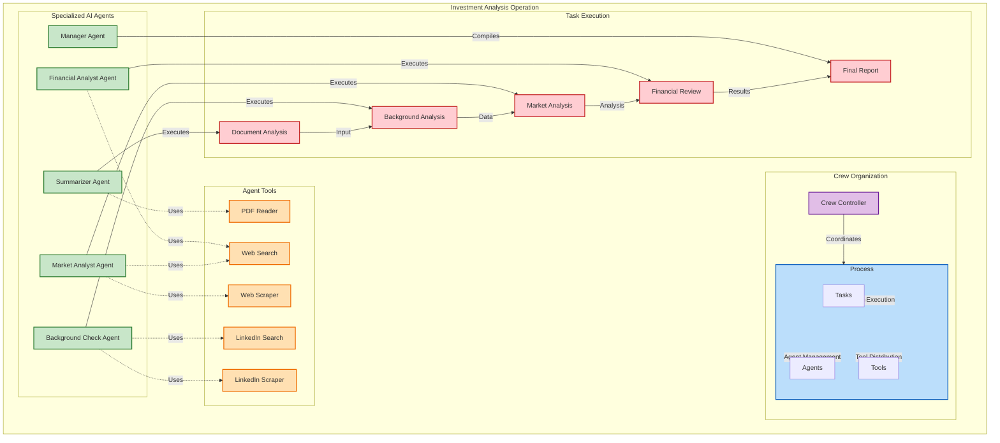

# Introduction

After my initial blog post about Large Language Module Agents called ["What are AI LLM Agents?"](https://stefanstranger.github.io/2024/09/04/WhatAreAILLMAgents/) I continued to learn how Agentic AI can be used for different scenario's I had in mind.

In the previous post I used [AutoGen](https://github.com/microsoft/autogen) for a scenario where I wanted to get [restaurant recommendations](https://github.com/stefanstranger/llmagents/blob/main/autogen/restaurant-assistant/README.md).

For another scenario I had in mind, which was investment analysis from a provided information of memorandum pdf file I used [CrewAI](https://crewai.com/). CrewAI is a framework aimed at streamlining AI application development, emphasizing collaboration among AI agents and human users to solve complex problems through multi-agent systems.

In the rapidly evolving world of artificial intelligence, Agentic AI stands out as a transformative approach that leverages the capabilities of multiple AI agents working collaboratively to achieve complex tasks. One compelling application of Agentic AI is in the realm of investment analysis, where AI agents can work together to provide comprehensive insights and recommendations. In this blog post, we'll explore how to harness the power of Agentic AI for investment analysis using a Jupyter notebook as our guide.

You can find the Jupyter Notebook [here](https://github.com/stefanstranger/llmagents/blob/main/crewainotebooks/investment_analysis.ipynb) (if you cannot wait to read this complete blog post)

When analyzing an investment, several roles are typically involved to ensure a comprehensive evaluation of the opportunity. Each role brings a unique perspective and expertise to the analysis process.

# Introduction to Agentic AI

Agentic AI refers to the use of multiple AI agents, each with specialized roles and capabilities, working together to achieve a common goal. This approach mimics the collaborative nature of human teams, where different members bring their expertise to the table to solve complex problems. In the context of investment analysis, Agentic AI can streamline the process by automating data collection, analysis, and reporting, ultimately helping investors make informed decisions.

# Crewai Crew
The Crewai Crew is the central component that coordinates the activities of various agents and tasks. It acts as the orchestrator, ensuring that each agent performs its designated tasks in the correct sequence and that the overall process flows smoothly. The crew is responsible for managing the inputs and outputs of the entire investment analysis process, making sure that all necessary data is collected, analyzed, and compiled into a comprehensive report.

# Agents
Agents are specialized AI entities within the Crewai framework, each designed to perform specific roles and tasks. In the context of investment analysis, we define several agents with distinct responsibilities:

1. **Summarizer Analyst**:

    A summarizer analyst reads the content of a information of memorandum PDF file and summarizes it into a concise report. They identify key points, extract important information, and provide a summary of the document. 

1. **Financial Analyst**:

    A financial analyst evaluates the financial health and performance of the company seeking investment. They analyze financial statements, assess profitability, liquidity, and solvency, and perform financial modeling to project future performance. Their goal is to determine the financial viability of the investment.

1. **Market Analyst**:

    A market analyst examines the market conditions and competitive landscape in which the company operates. They assess market trends, demand, competition, and potential growth opportunities. Their analysis helps determine the market potential and strategic positioning of the company.

1. **Background Check Analyst**:

    A background check analyst digs deep into a founder’s history to spot any red flags and verify credibility. They verify details like work history, education, and leadership roles, using platforms like LinkedIn. This comprehensive review helps investors feel confident that the founder is trustworthy and capable of leading the new venture.

1. **Manager**:

    The manager’s role is to coordinate and integrate the work of all the analysts into a unified investment analysis. They ensure that the financial, market, and background insights are aligned and synthesized into a cohesive recommendation for investors.

# Tasks

Tasks are specific actions that agents perform to achieve their goals. Each task is designed to process particular data and produce specific outputs. In the investment analysis flow, we define several tasks for our agents:

## Read PDF Task:

Performed by the Summarizer Agent, this task involves reading the content of a PDF document and summarizing the key points into a concise report.

## Market Analysis Task:

Performed by the Market Analyst Agent, this task involves continuously monitoring and analyzing market data for a selected industry and country. The agent provides insights and alerts about significant market opportunities or threats.

## Financial Analysis Task:

Performed by the Financial Analyst Agent, this task involves continuously monitoring and analyzing financial data for a selected industry and country. The agent provides insights and alerts about significant financial opportunities or threats.

## Background Check Task:

Performed by the Background Check Agent, this task 'scrapes' LinkedIn Profile information from the key people (founders) mentioned in the information of memorandum pdf file. This information helps assess the credibility and expertise of the team behind the investment opportunity

## Report Creation Task: 

Performed by the Manager Agent, this task involves compiling the final investment analysis report based on the input from other agents. The report is written in markdown format and is ready to be sent to the client.

# Connecting the Crew, Agents, and Tasks

The Crewai Crew connects agents and tasks to create a seamless investment analysis workflow. Here's how they are connected:

Initialization: The crew initializes the agents and assigns them their respective tasks. Each agent is equipped with the necessary tools to perform its tasks effectively.

Task Execution: The crew manages the execution of tasks in a sequential or parallel manner, depending on the process configuration. Agents perform their tasks, process the data, and produce the required outputs.

Data Flow: The crew ensures that the output of one task serves as the input for the next task, creating a continuous data flow. For example, the output of the Read PDF Task (a summary) may be used as input for the Market Analysis Task.

Final Report: The Manager Agent compiles the final investment analysis report based on the insights and data provided by other agents. The crew ensures that the report is comprehensive and ready for delivery to the client.

# crewAI process

# Conclusion

Agentic AI offers a powerful framework for automating complex tasks through the collaboration of specialized AI agents. By leveraging the capabilities of multiple agents, we can streamline the investment analysis process, providing investors with comprehensive insights and recommendations. The Jupyter notebook example demonstrates how to set up and run an Agentic AI system for investment analysis, showcasing the potential of this innovative approach.

Whether you're an investor looking to enhance your decision-making process or a developer interested in exploring the capabilities of Agentic AI, this example provides a solid foundation to get started. Embrace the future of AI-driven investment analysis and unlock new possibilities with Agentic AI.

# References

1. [Investment Analysis Notebook](https://github.com/stefanstranger/llmagents/blob/main/crewainotebooks/investment_analysis.ipynb)

1. [Blog post - "What are AI LLM Agents?"](https://stefanstranger.github.io/2024/09/04/WhatAreAILLMAgents/)

1. [AutoGen](https://github.com/microsoft/autogen)

1. [restaurant recommendations](https://github.com/stefanstranger/llmagents/blob/main/autogen/restaurant-assistant/README.md).

1. [CrewAI](https://crewai.com/)

